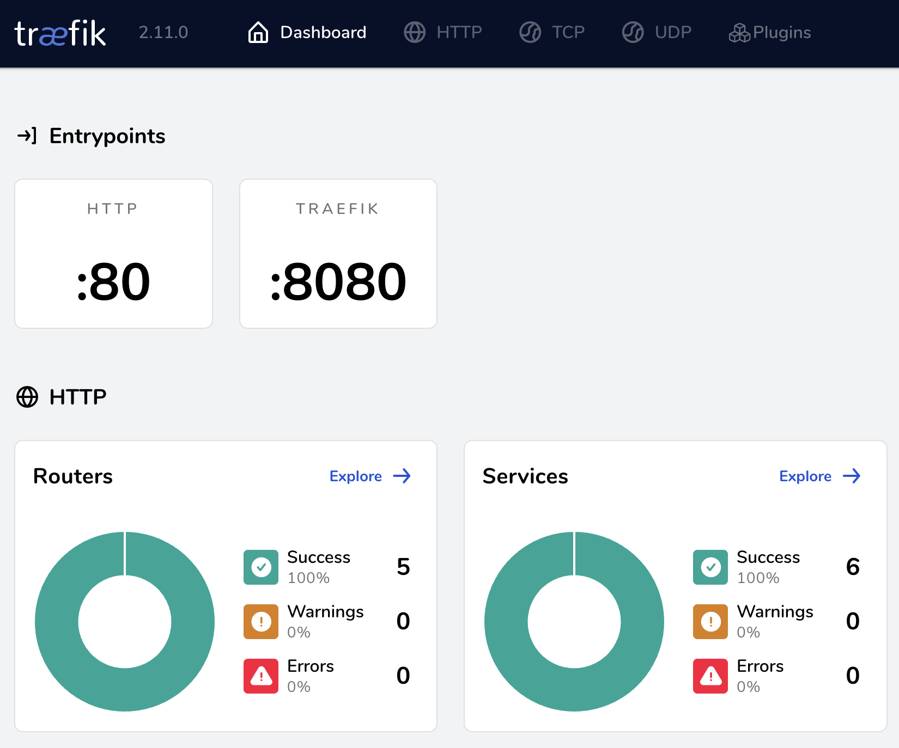
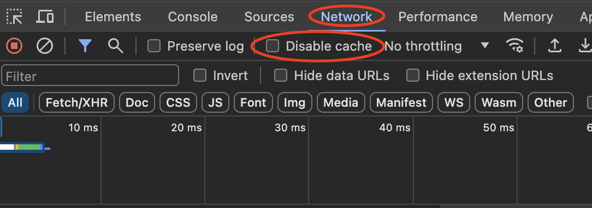

# Reverse Proxies
Reverse proxies are go-betweens that sit between a client and the backend. They are an abstraction, a facade, that sits in front of websites.

They can provide
- Present unified view of microservice backend to clients
- Load balancing
- Security, like better DDoS protection
- Caching
- Handle TLS and certificates
- Security and access control
- Rate limiting
- Error handling
- URL rewriting
- Analytics
- Request translation, say from HTTP to gRPC

Acting as a gateway to a ton of disparate microservices, a reverse proxy acting as an API gateway provides these core services:
- *Routing* requests to the various services and allowing the internal microservices to change, hopefully without disrupting the public-facing side.
- *Composing* data or requests among many disparate microservices. For example, orders and customer data could require two requests internally, but the public-facing side would only need to make one. It relieves clients from having to know about all the different microservices and how to query them.
- *Translating* requests from one IPC mechanism to another. Say, converting a public HTTP request to an internal gRPC request or vice versa.
- *Cross-cutting concerns* such as authentication and authorization, logging, rate limiting, etc.

Now, everything is tradeoffs, and we do make tradeoffs when introducing a reverse proxy like traefik. We need to make sure that the reverse proxy scales well and does not become a single point of failure.

In terms of microservices and distributed systems, we want to minimize the number of endpoints that clients need to be aware of. We can introduce an API gateway, via reverse proxy, that hides the microservice architecture from clients. We can route requests via the reverse proxy, change internal endpoints without breaking clients, stitch together data from multiple services, and handle data inconsistencies.

An API gateway is especially beneficial for public APIs backed by microservices. The gateway can also provide rate-limiting, caching, and authentication/authorization. Again, we need to be mindful of tradeoffs with a gateway: scaling, coupling, and microservice API changes. In terms of implementing an API gateway, you can
- Create your own
- Start with a reverse proxy like [nginx](https://www.nginx.com/) (pronounced engine-X) or [traefik](https://traefik.io/traefik/) (pronounced traffic)
- Use a managed service like Google's [Apigee](https://cloud.google.com/apigee?hl=en)

In this project, we'll learn and explore traefik. Nginx is supposedly faster but traefik's convenient, automagic service discovery shines through here and expedites learning.

## Traefik


The [docker-compose.yml](./docker-compose.yml) setup for traefik is quite straightforward:
```yml
services:
    # The official v2 Traefik docker image
  traefik:
    image: traefik:v2.11
    command: --api.insecure=true --providers.docker # Enables the web UI and tells Traefik to listen to docker
    ports:
      - "80:80" # Expose traefik's entry port
      - "8080:8080" # Optionally, expose traefik's dashboard
    volumes:
      - /var/run/docker.sock:/var/run/docker.sock # Lets traefik can listen to the Docker events

  # Your service running behind the proxy!
  # I've pulled in my super simplistic goginair project
  goginair:
    image: steve8550/goginair:latest
    labels:
      # Tells traefik to route requests to goginair
      - "traefik.enable=true"

      # And this tells traefik the routing rules
      # You can route to specific host names and url paths
      - "traefik.http.routers.api.rule=Host(`goginair.docker.localhost`)"  # Replace with your desired domain

      # And this specifies which ports to route requests to
      - "traefik.http.services.api.loadbalancer.server.port=8080"  # goginair listens on port 8080
```

Navigate to this directory via CLI, run `docker compose up -d`, and visit
- [`http://localhost:8080/`](http://localhost:8080/) to see traefik's dashboard


- Goginair's super boring home page at [`http://goginair.docker.localhost`](http://goginair.docker.localhost)


Warning: Traefik will cache the redirect from `localhost:8080` to `localhost:8080/dashboard`. Disable cache in the networking tab to make it stop:


## References
- Traefik's quick start is definitely helpful [here](https://doc.traefik.io/traefik/getting-started/quick-start/)