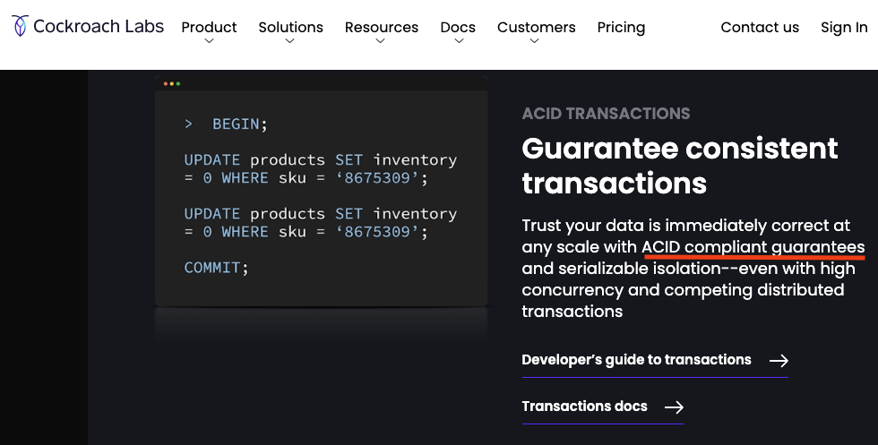

# System design
> 1. The network is reliable;
> 2. Latency is zero;
> 3. Bandwidth is infinite;
> 4. The network is secure;
> 5. Topology doesn't change;
> 6. There is one administrator;
> 7. Transport cost is zero;
> 8. The network is homogeneous.
> 
> – [Fallacies of distributed computing](https://en.wikipedia.org/wiki/Fallacies_of_distributed_computing)

- [System design](#system-design)
  - [Communication](#communication)
    - [The Internet protocol suite](#the-internet-protocol-suite)
    - [Border gateway protocol (BGP)](#border-gateway-protocol-bgp)
    - [User datagram protocol (UDP)](#user-datagram-protocol-udp)
    - [Reliable communications](#reliable-communications)
      - [Opening and the TCP handshake](#opening-and-the-tcp-handshake)
      - [Closing and the TIME\_WAIT](#closing-and-the-time_wait)
      - [Established connections and congestion control](#established-connections-and-congestion-control)
    - [Secure communications](#secure-communications)
      - [Encryption](#encryption)
      - [Authentication and certificates](#authentication-and-certificates)
      - [Data integrity](#data-integrity)
    - [Discovery and DNS](#discovery-and-dns)
    - [Application programming interfaces](#application-programming-interfaces)
      - [RESTful HTTP requests and responses](#restful-http-requests-and-responses)
      - [Synchronous HTTP requests](#synchronous-http-requests)
      - [Asynchronous HTTP requests](#asynchronous-http-requests)
      - [Synchronous HTTP responses](#synchronous-http-responses)
      - [Asynchronous HTTP responses](#asynchronous-http-responses)
      - [HTTP versions](#http-versions)
    - [Messaging](#messaging)
      - [Dead Letter Queue](#dead-letter-queue)
      - [Other Special Message Queues](#other-special-message-queues)
  - [Coordination](#coordination)
  - [Clocks](#clocks)
    - [CockroachDB transaction timestamps](#cockroachdb-transaction-timestamps)
    - [CAP and PACELC theorems](#cap-and-pacelc-theorems)
    - [Consistency](#consistency)
      - [Strong consistency](#strong-consistency)
      - [Sequential consistency](#sequential-consistency)
      - [Causal consistency](#causal-consistency)
        - [The CALM theorem](#the-calm-theorem)
        - [Causal consistency continued](#causal-consistency-continued)
      - [Causal+ consistency](#causal-consistency-1)
      - [Eventual consistency](#eventual-consistency)
    - [Transactions](#transactions)
    - [ACID](#acid)
      - [I is for Isolation](#i-is-for-isolation)
        - [Serializability](#serializability)
        - [Linearizability](#linearizability)
        - [Strict Linearizability](#strict-linearizability)
  - [Scalability](#scalability)
    - [Replication](#replication)
    - [HTTP caching](#http-caching)
    - [Partitioning](#partitioning)
      - [Ranged partitioning](#ranged-partitioning)
      - [Hash partitioning](#hash-partitioning)
    - [Load balancing](#load-balancing)
      - [Load balancing strategies](#load-balancing-strategies)
      - [Layer 4 and 7 load balancing](#layer-4-and-7-load-balancing)
      - [Load balancing failover](#load-balancing-failover)
      - [Load balancer uptime](#load-balancer-uptime)
      - [Service discovery](#service-discovery)
    - [Forward and reverse proxies](#forward-and-reverse-proxies)
    - [Content delivery networks (CDN)](#content-delivery-networks-cdn)
      - [CDN networks](#cdn-networks)
      - [CDN caching](#cdn-caching)
      - [Push and pull CDNs](#push-and-pull-cdns)
    - [Blob storage](#blob-storage)
      - [Blob vs File](#blob-vs-file)
        - [Traditional hierarchical file-based systems](#traditional-hierarchical-file-based-systems)
        - [Blob storage](#blob-storage-1)
      - [Blob storage](#blob-storage-2)
      - [Blob access](#blob-access)
    - [Microservices](#microservices)
      - [API gateway](#api-gateway)
        - [GraphQL](#graphql)
  - [Reliability](#reliability)
    - [Common failures](#common-failures)
    - [Risk](#risk)
    - [Redundancy](#redundancy)
    - [Fault isolation](#fault-isolation)
      - [Shuffle sharding](#shuffle-sharding)
      - [Cellular architecture](#cellular-architecture)
      - [Pool architecture](#pool-architecture)
  - [Monitoring](#monitoring)
    - [Pre-aggregation](#pre-aggregation)
    - [Metric and labels](#metric-and-labels)
      - [Metric types](#metric-types)
    - [Service level terminology](#service-level-terminology)
    - [Service level indicators](#service-level-indicators)
  - [Databases](#databases)
    - [Traditional databases](#traditional-databases)
      - [Keys](#keys)
      - [Indexes](#indexes)
    - [NoSQL databases](#nosql-databases)
    - [NewSQL databases](#newsql-databases)

## Communication
[Top](#system-design)

Communication is central to the Internet and distributed systems. To communicate, processes need to agree on a set of rules to determine how data is processed and transmitted.

### The Internet protocol suite
We represent internet communications in stacks known as the Open System Interconnection (OSI) model, using a layered model. The layers help break down the complex processes into something more understandable. There's a lot of layers of abstraction here!

Without further ago, here's the model:


Note that I've skipped diagramming out the lower levels such as the physical and the data link layers. 

- The **link layer** operates on local network links like Ethernet or WiFi and provides interfaces to the underlying network hardware. Switches operate at this layer and forward Ethernet packets based on their MAC addresses.
- The **internet layer** routes packets based on their IP address. The IP protocol is core at this layer. Packets are delivered on a best-error can can be dropped, duplicated, corrupted, or arrive out of order. Routers work at this layer, forwarding packets along based on their IP. Note that MAC addresses allow packets to be forwarded from one machine to the next. IP addresses provide the start and end machines.
- The **transport layer** transmits data between two processes. There are many processes on a machine that want to communicate and they do so through port numbers. TCP protocol is used at this layer and attempts make a reliable channel over an unreliable one (lol). Segments are given a number which lets the receiver know if packets are dropped, duplicated, or arriving out of order.
- The **application layer** defines the high level communications like HTTP or DNS. Often, this is the target abstraction for our work.

There are other layers: physical and data link. We'll briefly note them here:
- Physical concerns itself with voltages, pins, cabling, wireless frequencies, etc.
- Data link concerns itself with providing frames for the raw bits and provides some error correction/detection.

To be blunt, these layer models are totally bogus; however, they are helpful for conceptualizing the layers of abstraction in Internet communications.

It should also be noted that TCP is on its way out and being replaced by [QUIC](https://en.wikipedia.org/wiki/QUIC), aka TCP/2, which multiplexes connections between two endpoints using UDP. However, understanding TCP can help explain the motivations for implementing QUIC.

### Border gateway protocol (BGP)
Building and communicating routing tables lies with BGP. BGP maps out routes for forwarding packets along. Note that BGP is concerned about the minimum number of "hops"; it doesn't concern itself with congestion or latency.

ChatGPT says,
> "Let's imagine the internet is like a big neighborhood with houses (which are computer networks) that want to talk to each other. Now, each house has its own unique address, just like how each computer network on the internet has its own address.

As ChatGPT says, BGP is like a map of the neighborhood for the Internet. It helps all the houses (networks) figure out the best paths to reach each other. Just like how you might have different routes to get to different places in your neighborhood, BGP helps networks find the best routes to send information (like emails, pictures, or web pages) to each other.

But here's the tricky part: BGP doesn't know about all the small streets and houses. It mainly knows about the big roads and major intersections (these are like the main connections between different internet providers). So, when a house wants to send something to another house, BGP helps them find the best path using the main roads.

However, just like in a big neighborhood, sometimes things can change. Maybe a road is under construction, or a new road is built. BGP needs to quickly figure out these changes and update the map so that everyone can still send their information along the best paths.

So, in simple terms, BGP is like the map that helps computer networks on the internet find the best paths to talk to each other, just like you finding the best way to get to your friend's house in your neighborhood."

### User datagram protocol (UDP)
User datagram protocol (UDP) is an alternative to TCP. It is a connection-less protocol that only sends discrete packets of a limited size. It's bare-bones and offers no reliability guarantees. UDP typically bootstraps other protocols, that want some but not all of TCP's guarantees.

Online multiplayer video games or video streaming may leverage UDP. There's no value in retrying when data is dropped because it would only degrade the user experience.

### Reliable communications
TCP uses segments (not packets) that let receivers detect missing, duplicate, corrupted, and out of order data. Each segment is associated with a timer; if a receiver does not acknowledge the segment, it is resent.

Operating systems manage the **sockets** the store connection states: opening, established, closing. There are more than 3 states, but this keeps it simple.

#### Opening and the TCP handshake
The TCP handshake introduces a full round-trip before any app data is sent. Until a connection is opened the bandwidth is effectively zero. The faster a connection is established, the sooner communication can begin. Ergo, reducing round-trip time by moving servers next to each other reduces the cold start penalty.


Closing the connection, on the other hand, involves multiple round-trips. Additionally, if another connection might occur soon, it doesn't make sense to close the connection so it might stay open.

#### Closing and the TIME_WAIT
Sockets, and the resources they consume, do not immediately close. They enter a waiting state, where late arriving segments are dropped, so that they aren't considered part of a new connection. If you try to open and close many sockets (ports) in a tight loop, you can hit resource exhaustion on ports.

#### Established connections and congestion control
Once communication is started, the sender tries to avoid bombing the receiver with a ton of data. The receiver will shoot back it's buffer size to the sender, so that it doesn't get overwhelmed. TCP is rate-limited just like rate limiting on API key or IP address.

TCP will also try to avoid crushing the underlying network with a ton of traffic. The sender will hold onto a congestion window that'll track the number of segments without acknowledgement. When a segment is acknowledged, the sender can increase the traffic; when not acknowledge, the window is decreased. In fact, bandwidth can be represented by `bandwidth = window_size/round_trip_time`.

### Secure communications
TCP/IP does nothing to secure communications. We need to secure against:
- Spying on data (encryption)
- Unknown or wrong sender/receiver of data (certificates)
- Accidental or malicious changes to data (message auth code via SHA or similar)

Transport layer security (TLS) swoops in, runs on top of TCP, and provides encryption, authentication, and data integrity.

#### Encryption
Encryption means that the data are obfuscated and can only be read by the receivers. When TLS starts, the server and client swap public keys for asymmetric encryption. There's a really great blog on the subject [here](https://blog.cloudflare.com/a-relatively-easy-to-understand-primer-on-elliptic-curve-cryptography/). Once the keys are sent, both sender and receiver use symmetric encryption which is faster and cheaper to minimize overhead. Note that
- The shared keys are regenerated periodically to maintain safety.
- Basically, all traffic should use encryption due to modern CPUs having cryptographic instructions.

Note that the TCP handshake runs first, then followed by the TLS handshake. QUIC aims to speed this along some.

(Diagram by By Sedrubal - Own work, CC BY-SA 4.0, https://commons.wikimedia.org/w/index.php?curid=114587250)

#### Authentication and certificates
[Top](#system-design)

Even though we can secure communications, we still need to verify that the server is who it claims to be. This is done via certificates which include data about the owner, expiration, public key, and digital signature. The folks that grant certificates are called certificate authorities or CAs.

Certificates need to be present in the client in the client's trusted store. A trust store, also known as the certificate store, is a repository of certificates that the client trusts.
1. The server presents the certificate during TLS/SSL handshake
2. The client verifies the certificates, working up the certificate chain. It'll verify the certificates are valid and not expired.
3. The client will decide if the server is trustworthy. If not, it'll terminate the connection and/or display a warning message.
4. If all is good, the connection may proceed.

Here's an example of a certificate:
```
-----BEGIN CERTIFICATE-----
MIIDdzCCAl+gAw (many more random characters follow)...
-----END CERTIFICATE-----
```

Key values in the certificate are:
- **Version** of the X509 standard being used. Like version 3.
- The unique **serial number** of the certificate.
- The certificate authority that **issued** the certificate, aka, the issuer.
- **Validity period** states when the certificate is valid.
  - **Not before** some date, indicating when the certificate starts being valid
  - **Not after** some date, indicating when the certificate stops being valid
- **Subject** indicates which entity the certificate is issued for.
- The **public key** associated with the certificate and can be exchanged during TLS handshake.
- The **signature algorithm** used by the certificate authority to sign the certificate.
- A digital **signature** used to verify the authenticity of the certificate.

Now, each certificate is chained to an issuing identity, another CA, that granted the certificate. This creates a chain of certificates. The top-level, final certificate is the root CA, like Let's Encrypt.

Here's an example of a website (service), intermediate, and root CA chain.


We use a chain of certificates because:
1. It creates a hierarchy of trust. Root CAs are typically installed into a client's OS.
2. Allows client to verify the entire chain. If any one certificate is unreliable, the whole chain is considered untrustworthy.
3. We don't need to have 10 billion certificates stored in every client. The keys are distributed around.
4. New intermediate CAs can be added easily, making things scale nicely.

Note that a common mistake is to let the certificates expire, a single point of failure for your whole web stack's security. This'll cause all clients to not trust you. Automating certificate replacement is worth the effort at scale.

#### Data integrity
With encryption we can prevent others from reading the data. With authentication we can prove who we're talking with. However, even with all this, bits could get flipped accidentally or maliciously. A hash-based message authentication code (HMAC) is sent along during TLS. Note that TCP's checksum can fail to detect errors for 1 in 16 million to 1 in 10 billion packets. So, with packets of 1KB in size, it happens once in 16 GB to 10 TB of data transmitted.

### Discovery and DNS
[This video](https://www.youtube.com/watch?v=drWd9HIhJdU) is a solid deep dive into DNS and is worth a watch if you have the time. Even the first 15 minutes is valuable.

IP addresses are cool and all, but we need a way to lookup the IP addresses of servers. There's 2^128 IPv6 and 2^32 IPv4 addresses. Good luck remembering them. Worse yet, IP addresses of servers change all the time. Sometimes the admins need to move requests to a different cluster or spread load among many clusters. DNS helps with this.

Funnily enough, DNS is its own layer 7 protocol.

Anyway, the get-ip-address-from-domain-name is done via Domain Name System (DNS) and DNS resolution.

We're going from `www.amazon.com` to `192.0.2.1` in IPv4 or `2001:d68::1` in IPv6.

You can, of course, slap a port and IP address into the URL bar, but that's a lot of work. Instead we can take the domain name like something.com and resolve it into its IP address 1.2.3.4.

1. If it's a new domain name, the packets are routed to your ISP's DNS resolver. Your browser will cache IP addresses for domain names to save time.
2. The ISP's resolver will iteratively resolve the hostname for clients. It will also cache results.
3. If the ISP's resolver doesn't have it, it'll send a query to the root name server (NS). Root NS map the top-level domains (TLD) of the request, like `.com`. It'll give the address of the TLD server.
4. Once the ISP's resolver has the `.com` part, it'll query the TLD name server with `something.com`. This is the iterative part where the ISP's name resolver will iterate a lot.
5. The TLD name server maps `something.com` to an authoritative name server responsible for the domain.
6. We can return the IP address of `something.com` finally.
7. If there's an optional subdomain, like `definitely.something.com`, then the name server would return the authoritative name server for the subdomain and the process keeps going.

Again, the results are typically cached along the way. Similar to HTTP caching, DNS results are cached with a time to live (TTL) for how long the result is valid for. And, like HTTP caching, we can get some eventual consistency problems that surface. If the cache TTL is too long, then clients will try to connect to the wrong IP address. If the cache TTL is too short, you'll increase DNS load and increase avg response times for clients due to the several round trips DNS takes.

In terms of resiliency, DNS is single point of failure since normal humans simply won't find the IP address of your server and type it in to the browser URL. If, there's a failure and the TTL is stale, we could still try returning the stale result. Continuing to operate or partially operate while a dependency is down is called static stability.

Note that DNS used to be in plaintext, but now it uses TLS. Yay.

### Application programming interfaces
Once we can create semi-reliable and secure connections, we can finally discuss having a client invoke operations on a server. Typically, this is done through application programming interfaces (APIs). APIs can be **direct** or **indirect**.
Term | Definition | Example
--- | --- | ---
Direct | Client communicates directly with a server. | Request-response over HTTP or gRPC. Client sends a `GET /hello`, server responds with `200 OK Hi!`.
Indirect | Client communicates indirectly with a server via a message broker. They don't communicate directly. | A message bus via RabbitMQ or Google's Pub/Sub. Client adds a message, including any optional data, and the server does some processing when it receives the message.

We're going to focus on HTTP for request-response as it's quite popular. gRPC is also popular for inter-service communications via request-response communication.

Anyway, data are serialized via JSON, Protobuf, or similar. XML too, but I suspect it's not as widely supported now. JSON is human readable but slower to serialize and deserialize. Protobuf is not human readable and faster to serialize and deserialize. It's all about tradeoffs.

Now, for clients and servers both, requests and responses can be handled in synchronously, asynchronously, or with a mix of both.

#### RESTful HTTP requests and responses
- Requests are stateless adn contain all necessary information to process. Some requests can be re-executed and create the same response (idempotent). Some, are not.
- Responses are implicitly or explicitly labeled as cacheable or non-cacheable. If cacheable, the client can reuse the response.

#### Synchronous HTTP requests
After the client sends a request, it can simply block until the server responds. While "simple" this typically degrades the user experience quickly and wastes CPU time. We could be doing other stuff while waiting on this request. Note, performing synchronous HTTP requests is typically seen as un-cool.

```go
package main

import (
	"fmt"
	"io/ioutil"
	"net/http"
)

func makeSyncHttpRequest(url string) {
	response, err := http.Get(url)
	if err != nil {
		fmt.Println("Error:", err)
		return
	}
	defer response.Body.Close()

	body, err := ioutil.ReadAll(response.Body)
	if err != nil {
		fmt.Println("Error reading response body:", err)
		return
	}

	fmt.Println("Sync Response:", string(body))
}

func main() {
	url := "https://jsonplaceholder.typicode.com/posts/1"

	// Make a synchronous HTTP request
	makeSyncHttpRequest(url)

	// Continue with other work
}
```

#### Asynchronous HTTP requests
Alternatively, many languages like TypeScript, C#, and Go hide callbacks via async and await abstractions. We can avoid having the client freeze while waiting for the server to respond.

```go
package main

import (
	"fmt"
	"io/ioutil"
	"net/http"
	"sync"
)

func makeAsyncHttpRequest(url string, wg *sync.WaitGroup) {
	defer wg.Done()

	response, err := http.Get(url)
	if err != nil {
		fmt.Println("Error:", err)
		return
	}
	defer response.Body.Close()

	body, err := ioutil.ReadAll(response.Body)
	if err != nil {
		fmt.Println("Error reading response body:", err)
		return
	}

	fmt.Println("Async Response:", string(body))
}

func main() {
	var wg sync.WaitGroup

	url := "https://jsonplaceholder.typicode.com/posts/1"

	// Make an asynchronous HTTP request using a goroutine
	wg.Add(1)
	go makeAsyncHttpRequest(url, &wg)

	// Do other work concurrently if needed

	// Wait for all goroutines to finish
	wg.Wait()
}
```

#### Synchronous HTTP responses
The server receives a request, does some processing, and returns the entire response immediately. This is typically appropriate when the response is under ~10 MB and can be processed by the server relatively quickly, say in under ~60 seconds. For example, getting a single product's details would typically be straightforward. Listing all products would also be suitable, but the client and server may have to perform paging to get the entire list.

#### Asynchronous HTTP responses
Similar to synchronous, the server receives a request, initiates processing, but only returns partial or intermediate results. Clients will need to check back later to determine when processing is completed and where to get the results. This is appropriate for long running processes greater than ~60s or those with greater than ~10MB of data may benefit from this. Clients may be able to poll the processing status or they could provide a postback for the server to call later.

#### HTTP versions

### Messaging
Messaging is an indirect form of communication where data are passed through a message broker. This nicely decouples the services. Messaging is typically suitable for processes that take a long time or require large amounts of data.

Pub/Sub, ServiceBus, and RabbitMQ, are all examples of message queue providers. Like HTTP requests, messages typically have header and body data as well as a unique message ID. Also, messages can be stored in JSON, protobuf, and so on. Some brokers even provide support for native objects like Azure. Messages are typically only removed from the broker once the consumer - the service that actually receives and uses the message -  successfully processes the message.

However, unlike request-response via HTTP transactions, message queues are inherently asynchronous. Furthermore, messages can be queued within the broker even if the message consumers are down.

Consumers can choose to process multiple messages at a time, a.k.a. batch processing or message batches. This increases processing latency of individual messages but does improve the applications throughput. This extra latency is typically an acceptable tradeoff and should be considered.

Message queues are not a silver bullet and there are many issues to consider:
- The broker adds additional latency through additional the queue itself and more communication.
- There is a dependency on the broker itself. It it goes down, so does your system.
- Not all message queues are durable. Non-durable queues will lose all messages if the broker crashes.
- This is a form of sequential consistency. Consumers lag producers.
- There are similar problems to the IP protocol. Messages can be missed, dropped, duplicated, and arrive out of order. Note that some brokers provide message de-duplication.
- We have similar time and timestamp considerations to make, if there are many message producers. Multiple producers will not share the same clock.
- Broker storage is not infinite; there might be a maximum limit to the number of messages a broker can store.
- Consumers might be unable to keep up with producers and the queue which will cause a backlog of messages to accrue. This can be due to not enough consumer replicas, outages, and errors. Poisonous messages, those that repeatedly fail, can waste consumer time and degrade the entire system.
- Completely bad or poisoned messages can be dumped to a dead letter channel for manual inspection and correction by a human. This, of course, takes time. Alternatively, we can decide to drop (delete/ignore) bad messages, but we this means we might miss something important.
- Message queues are partitioned and bring along the same issues that partitioning brings. Messages may not arrive in order. Also, partitions can become "hot" and consumers might not be able to keep up. Message shuffling among the various partitions can reduce throughput.
- *Exactly once processing* does not exist. *At least once and maybe more* can lead to issues. Therefore, we can require messages to be idempotent, so that we can simulate exactly once processing.
- In fact, you may need to choose between *at most once but maybe zero* or *at least once but maybe more* processing.
- Still idempotent messages will not cure everything. Say we create a consumer that sends an email to a customer when it receives a message. However, due to a bug, the consumer crashes *immediately* after successfully sending the email and is unable to acknowledge (ACK) the message. The consumer and broker will simply try again and send another email up to some max retry limit, if there even is a retry limit. One way to potentially resolve this is by checking with the SMTP provider via an API, if available.

Producer and consumer messaging can be arranged in different styles or configurations, depending on the problem they're solving.

1. One-way - Producers can "fire n' forget" messages in a p2p configuration.
2. Request-response - Producers can send consumers requests through one message channel and receiver responses from consumers via another response channel. Consumers can tag responses with the request they're responding to and send feedback upstream.
3. Broadcast - Messages can be sent to all consumers. After all, there could be many consumers that care about the same message but for different reasons. For example, one consumer could send a confirmation email to the customer and another consumer could do payment processing.

TODO: PlantUML diagrams on the different pub/sub topologies would be helpful here.

#### Dead Letter Queue
Not all messages are handled successfully. When this happens the message is retried. If it succeeds the next time, great. If it fails many times, the message will typically be placed into a special dead letter queue (DLQ). This stops the message from wasting more resources, gives engineering a chance to debug the issue, and lets the message be properly processed or disposed of.

Each normal message queue typically has its own DLQ.

#### Other Special Message Queues
You other special types of queues.
1. Poison queue - Messages may have malformed data or logic errors. For example, perhaps the JSON syntax of the message could be wrong. In this case, they can be sent to a poison queue for engineering to sort out.
2. Retry queue - Some consumers may experience a service outage or network issue where the message is completely fine but needs to be retried much later. In this case, we could put messages into a retry queue to be sent to the consumer later.
3. Audit queue - Some companies or projects could require more rigorous auditing and logging. In this case, we can employ an audit queue to store a copy of messages temporarily. Maybe we would only store a copy of "bad" messages or similar until a post-mortem is completed.

## Coordination
[Top](#system-design)

To be blunt, getting multiple computers on an asynchronous network to agree on something as simple as the number of visitors to a page can become surprisingly hard. This section really gets to the question of "Do you want the computers to give you the same answer or do you want them to give you an answer quickly? Fast or accurate?" And fast-or-accurate is a spectrum; sometimes sacrificing some accuracy is totally fine and makes for a great solution. And sometimes it doesn't.

Note that there are more tradeoffs than just fast-or-accurate. For example, eventual consistency can create weird looking errors and maintenance headaches.

## Clocks

### CockroachDB transaction timestamps
CockroachDB uses a computer's physical clock for commit timestamps and also adds an upper bound with the maximum clock offset for the entire cluster. The interval is `[timestamp, timestamp + offset]`. As long as other transactions do not occur during this interval, everything proceeds normally. For example, in the boring case, if T1 has an interval of [0, 10] and T2 has interval of [20, 30], then T2 will read the values and overwrite as needed.

However, if T2's interval was [5, 15], then in occurs within T1's interval. We don't know if T1 ever actually committed its values yet or not. So, CockroachDB simply restarts the transaction, bumping T2's timestamp to [11, 15], just immediately after T1's maximum timestamp encountered but keeping the maximum offset the same. Therefore, CockroachDB sometimes retries a read to adjust for clock skew.

### CAP and PACELC theorems
["CAP Theorem: You don't need CP, you don't want AP, and you can't have CA"](https://www.youtube.com/watch?v=hUd_9FENShA)

Engineering is, in part, about tradeoffs. Distributed systems are no different. CAP theorem, can be summarized as "strong consistency, availability, and partition tolerance: pick two of three." Except...
- Network partitions are simply unavoidable, so you really just get to pick between availability and consistency
- But, also, CAP defines available as *eventually* getting a response but we know that perfect availability is impossible
- And also a slow response is as bad as not receiving one at all.
- Network partitions are rare in a data center. It can certainly happen though.

So, while helpful, CAP is limited in its practical application. This is, again, about tradeoffs. The PACELC theorem, an extension of CAP, expresses this as, when a network is partitioned (P), choose between availability (A) and consistency (C). Else, when operating normally (E), choose between latency (L) and consistency (C). We see that this is not some binary choice between AP and CP, but rather a spectrum of tradeoffs between the various consistency models and latency. Indeed, some systems like [Azure's Cosmos DB](https://learn.microsoft.com/en-us/azure/cosmos-db/consistency-levels) allow you to choose the consistency model you want which is neat.

### Consistency
Warning: This sections discusses CAP consistency for distributed systems. The concept of consistency discussed in ACID and CALM are different things!

With that in mind, distributed consistency models are different strategies for keeping computers on the same page in terms of data. Consistency models are a set of guarantees - or lack of guarantees - about what state the data will be in when you ask certain nodes.

Put another way, distributed systems are often modeled around consistency models which define how updates to a distributed system are observed. With different models, you may see data visibility, ordering of operations, performance differences, fault tolerance, ease of implementation, and ease of maintenance.

Let's describe this in a third, easier way. To get two computers to agree on a value, they need to communicate, and communication takes time. However, the computers can give you an answer sooner, but you might get different values if you ask different computers! In other words, as a system becomes more available, it becomes less consistent.

For example, say you have two computers serving a webpage. If you ask the computers how many visitors a single page has received, you could get two different answers! They need to share with each other how many visits they've received. Maybe one computer has an old value and hasn't been informed of visits from the other computer yet. Alternatively, instead of waiting for the computers to agree, we can increase performance and give you a maybe not up-to-date count of the visits.

To be blunt, there's a ton of these models, so we'll cover the main ones.

#### Strong consistency
Strong consistency ensures all nodes have the same view of data at any given time.
- All operations appear to be synchronous and read operations appear to return the most recent write.
- Typically uses distributed locks to agree on the order of operations.

There are a few ways we can build distributed systems to achieve strong consistency: consensus algorithms like Paxos or Raft, quorum (majority) of nodes agreeing on a change, and chain replication where only the head node accepts reads and writes.

ChatGPT says,
> "Strong consistency is like having a rule that everyone, including friends in different rooms, always has the same information at the same time. If you say something to Alice, all your friends instantly know about it. It's like the information spreads quickly to everyone."

#### Sequential consistency
Sequential consistency ensures operations occur in the same order for observers but does not make any real-time guarantees about when an operation's side effect becomes visible. There's a boost in performance but we drop some consistency on the ground. A read from Server A may appear different than Server B, but the operations are sequential so Server A and B will eventually converge and agree. In other words, the replicas are diverging on their view of the world.

A producer/consumer system, synchronized with a message queue, is an example of a sequential consistency. The consumer lags behind the producer. Another example could be chain replication where head accepts writes and the tail serves reads.

ChatGPT says,
> "Now, let's say you and Alice have regular walkie-talkies, but you both agree to take turns talking. So, the messages go back and forth in the order you send them. It's like having a clear order for your conversation."

#### Causal consistency
Causal consistency relaxes some guarantees of strong in favor of speed. Causal guarantees that causally related operations are in a consistent order and preserves causality. For many applications, it's considered "consistent enough", easier to work with than eventual consistency, and faster than strong consistency.

Before we continue, we need to discuss the CALM theorem quickly. So, stay CALM (Get it? Stay calm!!? About the theorem? Funny, right?)

##### The CALM theorem
The Consistency As Logical Monotonicity (CALM) theorem uses logic to reason about distributed systems and introduces the idea of monotonicity in the context of logic. Furthermore, it helps give us a framework to determine if we can move coordination off the critical path. That is, CALM tells us if we can get to coordination-free distributed implementations but only if the system is monotonic.

Logically monotonic means that the output only further refines the input and there's no taking back any prior input.

Very important note: The consistency in CALM is not the same as the consistency in CAP or distributed systems. With CALM, we're referring to the consistency of a program's output. We'll also see a different definition of consistency when discussing transactions and ACID. Context is important when discussing consistency.

Variable assignment is non-monotonic. When you assign something to a variable, the previous value is gone forever. Take a counter value that does

write(1), write(2), write(3) => 3
but then if they show up out of order:
write(1), write(3), write(2) => 2

We end up with the wrong value.

In contrast, incrementing allows us to reorder in any way and still get the correct output:
increment(1), increment(1), increment(1) => 3

Check out [Keeping Calm PDF](https://arxiv.org/pdf/1901.01930.pdf) for a much better and detailed description.

##### Causal consistency continued
Back to causal consistency. Causal maintains happened-before order (the causal order) among operations. This makes causal attractive for many applications because:
- It's consistent "enough" and easier to work on the eventual consistency.
- Allows building a system that's available and partition tolerant.

This requires that nodes *agree* on the causally related operations but may *disagree* on the order of unrelated ones. Put another way, the nodes preserve the logical order.

Causal systems are typically backed by conflict-free replicated data types (CRDTs), such as
- *Last writer wins (LWW)* - Values are associated with a logical timestamp/version. When the value is broadcasted, nodes only keep the greatest timestamp. Conflicts due to concurrent updates are usually resolved by taking the greater timestamp, but this might not always make sense.
- *Multi-value (MV)* - Store the operations in a log of operations that all nodes share. New values are inserted into the MV register. Systems will need to share out their MVs.

ChatGPT says,
> "With causal consistency, you and your friends agree on some logical order for the messages. If you tell something important to Alice and then mention it to Bob, everyone knows that Alice got the message first. It's about maintaining the cause-and-effect relationship."

#### Causal+ consistency
TODO: Discuss causal+ and how it's different from Causal. We need to talk about CRDT types too.

#### Eventual consistency
Eventual consistency relaxes guarantees of strong and sequential. Given enough time, all nodes will converge to the same result. Note that, during updates or partitions, nodes may have different values. For example, reading from Server A and B may yield a stale, earlier result which is very confusing.

Imagine uploading an image to a social network and add it to gallery. Except, when you try to view the gallery, you get a 404; strangely, you already received a message upload success message! Very odd to an observer, but very real in distributed world.

Regardless, eventual can be appropriate tradeoff for certain systems. Slightly different results are perfectly acceptable to achieve higher speeds such as returning the number of users on a website. The number of active users can be stale, and it's typically not a big deal. Note that eventual consistency can be a maintenance burden due to subtle, unexpected bugs.

ChatGPT says,
> "Now, suppose your friends have regular walkie-talkies, and sometimes messages take a while to reach everyone due to delays. Eventual consistency says that, given enough time without any more messages, eventually, everyone will have the same information. It's about waiting until things settle down."

### Transactions
[Top](#system-design)

Distributed transactions provide an illusion that all operations succeeded or none of them did. These are similar to transactions used in a traditional SQL databases. Here's a simple MySQL transaction that get's data from table1, updates table2 with it, and commits the transaction. If the select or update fail, then the entire select+update operations are rolled back safely to a previous state.

```sql
START TRANSACTION;
SELECT @A:=SUM(salary) FROM table1 WHERE type=1;
UPDATE table2 SET summary=@A WHERE type=1;
COMMIT;
```

Note that if the transaction is never finally committed via `COMMIT` or reversed via `ROLLBACK`, you could give yourself a bad time. The transactions hold locks, create resource contention, and so on. So don't forget and make sure your SQL is somewhat speedy!

See more transaction usage in [MySQL](https://dev.mysql.com/doc/refman/8.0/en/commit.html) or [SQL Server](https://learn.microsoft.com/en-us/sql/t-sql/language-elements/transactions-transact-sql?view=sql-server-ver16).

Transactions allow us to focus on solving actual programming problems instead of worrying about DB error handling.

### ACID
ACID stands for atomicity, consistency, isolation, and durability.

- **A**tomicity - No partial failures. Either the whole thing succeeds or the whole thing is rolled back as if the none of the operations took place. This must occur whether a single update failed or if the entire DB crashes. All or none. Period.
- **C**onsistency - Transactions will move the DB from one correct state to another correct state. No half-baked, partial results from only a portion of the operations. Only a good DB state. We'll ignore consistency here since it's an overloaded term and is a property of the application, not the database. This consistency is different than distributed system consistency models, and we're going to ignore it here.
- **I**solation - An illusion that no other transactions are running. There are no race conditions, i.e., no sharing of resources.
- **D**urability - Once we commit, any changes are persisted to storage and the DB won't lose data if it crashes. Again, this is an illusion and we need replication to stave off storage failures.

Why are we ignoring consistency in ACID? Consistency is purportedly a property of the application, not the DB system:

*From The Meaning of ACID, page 225, Chapter 7, Transactions.*

Separately, DB marketing materials stating that they provide ACID might not actually be true. To be ACID compliant, typically the DB needs to support serializable isolation which can be a hit to performance ([here](http://www.bailis.org/blog/when-is-acid-acid-rarely/)). [Jepson.io](https://jepsen.io/analyses) provides some more analyses on which tools are actually ACID compliant or not.

For example, Cockroach's marketing material states ACID serializability, so it's consistency guarantees are weaker than Google's Spanner DB which has linearizability. Now, the good folks working on Cockroach DB aren't lying or anything; quite the contrary as [this blog](https://www.cockroachlabs.com/blog/living-without-atomic-clocks/) shows and serializability checks is typically "isolated enough". In short, we just need to be careful because marketing materials and the database defaults do not always equal serializable guarantees!

And serializability is not the strongest guarantee we can make; however, that might be an acceptable tradeoff, as is the case with CockroachDB.



#### I is for Isolation
Isolation gives us an illusion that transactions run one after another, as if they run in wall-clock order. This is inefficient, so typically transactions are run concurrently. As a result, we can get all kinds of race conditions. *Isolation levels* protect against these race conditions. However, as our isolation levels provide more protection, the less performant they become. Again, coordination has a cost.

[Jepsen](https://jepsen.io/consistency) provides a really great, clickable chart with details on many kinds of DB consistency models. Here's an image of it:


There's a lot of models, but we'll focus on the main ones.

**Don't get these consistency models confused with consistency in distributed systems or in the CALM theorem. Context matters here!**

##### Serializability
Serializability is a guarantee about a transaction or group of operations concerning more than one object, and still preserves the correctness of the database. However, unlike serializability, there are no real-time constraints on the ordering of transactions. Serializable operations are not composable or provide deterministic ordering of events. It only requires that some equivalent serial execution exists.

Using Google's same example, we have two transactions:
1. Transaction T1 (Deposit): Move $200 into the savings account.
2. Transaction T2 (Debit): Debits $150 from the checking account.

In a serializable system, there could potentially - potentially being the keyword here - be an overdraft because T2 occurs before T1. The end result will be the same, however.

Whew, are we done!? No.

##### Linearizability
Linearizability is a guarantee about single-operations, single-objects, with a real wall-time ordering for a set of single operations. Writes appear to be instantaneous. Once the write occurs, all subsequent reads will return the same value. Linearizability is also known as atomic consistency. Linearizable operations are composable; if each object is linearizable, then all operations are linearizable. Again, linearizability is very concerned with wall-clock style ordering of events for clients.

Google's Spanner has linearizability guarantees described [here](https://cloud.google.com/spanner/docs/true-time-external-consistency). This article does a good job describing linearizability with a tangible example:
> "External consistency (linearizability) greatly simplifies application development. For example, suppose that you have created a banking application on Spanner and one of your customers starts with $50 in their checking account and $50 in their savings account. Your application then begins a workflow in which it first commits a transaction T1 to deposit $200 into the savings account, and then issues a second transaction T2 to debit $150 from the checking account. Further, assume that at the end of the day, negative balances in one account are covered automatically from other accounts, and a customer incurs a penalty if the total balance across all their accounts is negative at any time during that day. External consistency guarantees that because T2 starts to commit after T1 finishes, then all readers of the database will observe that the deposit T1 occurred before the debit T2. Put another way, external consistency (linearizability) guarantees that no one will ever see a state where T2 occurs prior to T1; in other words, the debit will never incur a penalty due to insufficient funds."

[This article by Peter Bailis](http://www.bailis.org/blog/linearizability-versus-serializability/) goes into great detail about he difference between serializable and linearizable.

##### Strict Linearizability
Strict Linearizability is linearizability + serializability. Transaction order corresponds to some serial execution order which corresponds to some real-time wall-clock ordering. All operations must follow an order, appear to occur instantaneously, and the system must exhibit a global, real-time ordering of all operations. Continuing with the prior example, if T1 happens before T2 in real-time, it is guaranteed that all clients will observe the deposit to the savings account before the debit from the checking account. This ensures a consistent, global order of operations, providing a strong guarantee of real-time consistency in the observed behavior of the distributed system.

1. *Dirty writes* - A transaction overwrites the value of another transaction that hasn't committed yet. This race condition is stopped by *read uncommitted* isolation level.
2. *Dirty reads* - A transaction reads the value of another transaction that hasn't committed yet. This race condition is stopped by *read committed* isolation level.
3. *Fuzzy reads* - A transaction reads a value twice, but sees a different value between the two reads because a transaction changed the value between the reads. This race condition is stopped by *repeatable read* isolation level.
4. *Phantom reads* - One transaction adds, updates, or deletes values while another tries to read them. This is stopped by *serializable* isolation level.


There are way more consistency models than those listed here. Jepsen.io has a great clickable diagram with many different consistency models, what they mean, how they relate to one another, and when they are available on an asynchronous network [here](https://jepsen.io/consistency). Really helpful diagram.

## Scalability
[Top](#system-design)

Basically, we have three ways to scale out applications:
1. Decomposition: Breaking the processing into separate services known as decomposition or functional decomposition.
2. Partitioning: Dividing data into partitions and distributing data among different nodes.
3. Replication: Replicating functionality or data among nodes.

### Replication
As an application scales up, eventually, a single server simply won't be able to keep up. It'll simply fall over.

So, just clone your server's code and you'll be good to go, right? Wrong. Welcome to replicas, consistency models, distributed locking, CRDTs, and so on.

### HTTP caching
Static resources like CSS, JS, JSON, etc. don't typically change super often. The client's browser can cache the results which boosts response time, lowers server load, etc. In terms of APIs, only reads (GET and HEAD) are cacheable. The other verbs modify data.

The first time a client requests static resource, we can reply with the resource plus add a Cache-Control HTTP header with how long to keep the resource (time to live or TTL) and the ETag (resource version).


If the cache resource is stale (age > max-age), we'll request it from the server again. Otherwise, the next time the same resource is requested, we'll get it from the cache.


This is great because we simply added a HTTP header and reduced server load and boosted response time for the client. Unfortunately, we added eventual consistency, especially if the caching is poorly managed.

For example, in the worst cases, say the dev team changed an endpoint with a breaking change and updated the JavaScript that hits this endpoint. If the client is still using an old JavaScript file due to improper headers/caching, they'll get an error when trying to use the endpoint with the wrong JavaScript code. This will require clients to perform a hard reload, wait for the resource to expire, or simply try again and hope that the consistency is there.

Regardless, this is typically a good price to pay by being careful when using the cache, using cache-busting techniques, use CSS/JS/whatever hash codes or versions like `<link rel="stylesheet" type="text/css" href="styles.css?hash=abcd1234">` or `<link rel="stylesheet" type="text/css" href="styles.css?v=1">`. Alternatively, we can force clients to retrieve static resources from different URLs.

Note that HTTP caching treats reads separate from writes like CQRS.

### Partitioning
As our data storage and access grows, one machine will simply be unable to handle everything by itself. To continue to scale, we can partition (divide up) or federate data among other nodes. With more nodes, we will be able to spread the load through an increased system capacity. Typically, this partitioning, or mapping data to an appropriate *shard*, is done through a coordination service like Apache Zookeeper which will be able to map data to nodes.

Partitioning has costs, however.
- We now have a new dependency on a coordination service with all the fun that brings.
- Adding or removing partitions could require shifting a lot of data. We want to avoid shifting data to redistribute load where possible because it's time consuming and disruptive.
- Performing aggregate calculations (sum all order totals, count all customers, etc.) requires querying data among many shards.
- "Hot" or frequently accessed partitions may limit the systems ability to scale.

There's basically two broad types of partitioning: ranged and hash.

#### Ranged partitioning
Ranged partitioning means dividing the data by time, names, or some other value. Ranged partitioning can be tricky, however, as we need to distribute our keys well to keep up with demand and load.

For example, say we created shards to hold customers, one for each letter of the alphabet. We might expect that the Z shard won't get nearly as much traffic as S. In fact, we might get so many S customers that we need to split (rebalance) the S shard into two just to keep up! Similar issues can arise from using time to divide data.

There are some ways to fight against this. We can allocate bonus shards ahead of time, more than we need, to keep up with demand. However, the shards may still have hotspots or be under or over utilized still. Another option is *dynamic sharding* where the system will automagically split and merge partitions based on size and access. If a shard is too large or accessed very frequently, we can split the shard to spread load and vice versa.

Note that we can attempt to prefix IDs to get a better distribution, but this can be tricky and complex.

#### Hash partitioning
Another option is to use a hashed value for distributing requests or data. Hash values themselves can end up being more random than customer names and would potentially distribute data or requests more evenly.

Note that we prefer to use [consistent hashing](https://en.wikipedia.org/wiki/Consistent_hashing) to distribute load instead of naively using modulo or similar. Adding or removing partitions using modulo would be quite disruptive, causing most keys and associated data to be re-organized into different nodes. Consistent hashing minimizes this disruption.

Note that we lose convenient sorting that ranged hashing provides when using hash partitioning. This can be somewhat relieved by using secondary keys for sorting on an individual partition.

### Load balancing
[Top](#system-design)

If we have multiple application servers, we can route requests to all them. Now, this is actually somewhat tricky to do well.

Servers, behind the load balancers (LBs) will scale up and down transparently to consumers. If LBs detect faulty servers, it can remove them from the server pool.

#### Load balancing strategies
There are tons of strategies for shelling out load to server replicas, but it's tricky. For example, we could:
- Split requests evenly -> Except some servers might have more hardware resources than others. Not all servers are exactly the same!
- We could expose a health endpoint and read the CPU load -> Except a CPU that just comes online could get bombed by requests. Then, when it's overloaded, it'll go back down to zero only to be hammered again!

Name | Description
--- | ---
Round robin | Sling requests to servers in order, one at a time. LB1 -> LB2 -> LB3 repeat.
Weighted round robin | Some servers are more powerful than others. We can give more requests to the stronger servers. Say LB2 is stronger, we could do LB1 -> LB2 -> LB2 -> LB3.
Least connections | Sometimes, a server might draw the short straw and get overwhelmed with a bunch of long running requests. This is a dynamic LB strategy where we give requests to servers with the least active of connections.
Weighted least connections | Similar to least connections. Servers are dynamically scored based on the servers resources.
Resource based (adaptive) | The LB can get health checks from the servers and their overall health. Scores and requests can be dynamically assigned based on the servers returned status check.
Resource based, (Software defined network adaptive) | Using OSI layers 2, 3, 4, and 7, the LB can make optimized traffic decisions based on network congestion or similar.
Fixed weighting | Servers are assigned a scored (weighted). The highest score will get the requests and then failover to the next highest score. This one is useful where a single server is expected to handle all the traffic but be assigned a failover server.
Weighted response time | The LB can use a server's response time to decide where to send traffic. The fastest server wins the next request.
Source IP hash | The source and destination IPs are hashed and used to direct requests. This one is useful if all requests need to go to the same server.
URL hash | Similar to source IP hash except the requested URL is used instead and helps ensure requests are sent to the same servers.

So, lots of strategies we can try. Supposedly, randomly picking two servers and assigning the request to the one with lower load works well ([here](https://brooker.co.za/blog/2012/01/17/two-random.html)).

#### Layer 4 and 7 load balancing
Load balancers can make routing decisions based on information extracted from bytes in the TCP stream (transport layer 4) or from the HTTP header, cookies, or resource type (application layer 7). Note that, layer 4 vs 7 is talk here is intended to be more useful for learning than 100% accurate. It's more complicated than pick layer 4 vs 7 - done.

- Layer 4 requires less computing resources as there's less protocols to process, you maybe don't have to wait for the entire packet, etc.
- Layer 7 load balancing is often desired for sheer flexibility since, at layer 7, we have a full understanding of the request being made.

Typically, besides higher flexibility, hardware nowadays is powerful enough and to make layer 7 LBs outweigh layer 4 LBs.

#### Load balancing failover
A single LB presents a single point of failure. If the single load balancer goes down, then the whole system behind it goes down as well. To maintain availability, we can have multiple load balancers in active-active or active-passive configurations.
- Active-active = There are multiple, ready LBs in use. If one active goes down, then another is ready to take the additional load.
- Active-passive = One LB is active, another LB is in standby. The standby LB is ready to hop in if the active one goes down.

#### Load balancer uptime
The more nines you need, the more LBs you'll need to supply. Now, this isn't perfect, but the availability is roughly `1-(Nines^LB_Count)`. So, two servers with 99% availability becomes `1-(0.01*0.01)=0.9999`. Now, this doesn't really account for chained failures 

#### Service discovery
Again, servers can come up and down frequently. A coordination service like Apache Zookeeper or Kubernetes can help with this.

References:
- [Load balancing algorithms](https://kemptechnologies.com/load-balancer/load-balancing-algorithms-techniques)

### Forward and reverse proxies
[Top](#system-design)

ChatGPT says,
> "Let's imagine you want to get a toy from a toy store, but instead of going there yourself, you send your friend to bring it back for you. In this scenario, your friend is acting like a proxy.
> 
>There are two types of proxies: forward proxies and reverse proxies.
>
>Now, a Forward Proxy (like your friend going to the store): Imagine you want to visit different toy stores, but you don't want the stores to know it's you every time. So, you send your friend to the stores, and your friend brings the toys back to you. The stores only see your friend, not you. This is like a forward proxy; it helps you access different things on the internet without directly interacting with them.
>
>Reverse Proxy (like a helper at the toy store): Now, let's say you go to a huge toy store, and there's a helper at the entrance. Instead of going inside to get each toy yourself, you tell the helper what you want, and the helper gets the toys for you. The helper is like a reverse proxy because it helps you get what you need from the store without you having to go all the way in. In the internet world, a reverse proxy helps websites give you the things you want (like web pages or pictures) without you directly talking to the main server.
>
>In summary, proxies are like helpers or friends that help you get things from different places, and reverse proxies specifically help websites give you what you want without you having to go to the main server every time."

### Content delivery networks (CDN)
[Top](#system-design)

CDNs are collections of caching servers. When clients request certain resources, like images or video, they can be served from physically close CDNs that cache the content. If the CDN doesn't have the resource, it'll request the content from the "origin server" (read: your application server) from the original URL. The resource is stashed locally and finally served to the client.

#### CDN networks
The main power of CDNs isn't the caching, it's actually the CDN network itself. BGP doesn't concern itself with latencies or congestion. CDNs can exploit and optimize various techniques to increase bandwidth. They have persistent connections and optimal TCP window sizes to maximize bandwidth.

Furthermore, CDN are optimized in terms of location and placement. There's a global DNS load balancing, an extension of DNS, that considers client location via IP address and returns a list of the closest clusters, network congestion, and cluster health. Next, CDNs are placed at internet exchange points, points where ISPs connect together.

#### CDN caching
The top level servers in CDN are the edge servers/clusters. If content is unavailable at the edge, the edge will get the content from the origin server while leveraging the overlay network.

Now, imagine there's hundreds of edge CDN servers. They could end up overwhelm origin servers (read: your servers) due to a low cache hit ratio. More edge servers, closer physically, but more misses. Less servers, further physically, but more content hits. To alleviate this pressure on the origin servers, CDNs have intermediate cache servers with a larger amount of content.

Note that CDN content is partitioned among many servers because no one computer can handle all the content. Reminder that partitioning is a core scalability pattern.

#### Push and pull CDNs
Before clients can get resources from a CDN, the content needs to be delivered to the CDN somehow. And there are tradeoffs to consider.
- Resources can be **pushed** to the CDN. That is, software engineers push assets up and then those assets are propagated through the other CDN nodes. Push is flexible and can be accurate, but it requires engineers to put in maintenance effort.
- **Pull** CDNs will fetch assets based on request. If the CDN doesn't have the asset, it'll be retrieved from the origin server. Pull CDNs relax the maintenance burden and save space as assets are only uploaded on request. Unfortunately, pull CDN disadvantage comes in the form of duplicate requests to the origin server. If an asset isn't cached and CDNs receive many requests, they can send duplicate requests to the origin server for content. Also, first time visitors will have a slow experience. One could offset this by manually requesting pages as soon as they are available, however.

### Blob storage
[Top](#system-design)

Now, even with using a CDN, our file storage and access speed is limited. We can circumvent this using blob storage which store files in a scalable, available, and durable way and can be configured to be private or public.

Modern blob storage has tons of great abstractions like files, queueus, and tables. Amazon's S3 even allows you to query file data with SQL via S3 Select which is super cool. We'll only focus on file storage here.

#### Blob vs File
Blobs themselves are considered to be more generic than a file. Blobs can include really any binary data include images, audio files, video files, DB records, executables, cryptographic data, etc.

##### Traditional hierarchical file-based systems
These traditional file storage systems include File Allocation Tables (FAT) and New Technology File System (NTFS). Broadly speaking, they store files like:
```
C:\
├── Program Files
│   ├── Microsoft Office
│   │   ├── Word.exe
│   │   ├── Excel.exe
│   │   └── PowerPoint.exe
│   └── Adobe
│       ├── Photoshop.exe
│       └── Illustrator.exe
├── Users
│   ├── User1
│   │   ├── Documents
│   │   │   └── Report.docx
│   │   └── Pictures
│   │       └── Photo1.jpg
│   └── User2
│       ├── Documents
│       └── Pictures
└── Windows
```
- **Organization:** They organize data in a hierarchical or tree-like structure with directories (folders) and files.
- **Metadata:** Each file and folder typically has associated metadata, such as file attributes, permissions, and timestamps.
- **Access Methods:** Files are accessed using a file path within the hierarchical structure, and traditional file operations like reading, writing, and deleting are common.
- **Structured Storage:** These systems provide a structured way to store various types of data, including text files, executables, and multimedia files, within a file hierarchy.
- **File Naming:** Files are often identified by names within their respective directories.

##### Blob storage
Binary Large OBject (BLOB) are used to efficiently store and retrieve data. Blob's are considered more general than files and do not have the strict adherence to hierarchy. It also introduces different access patterns and using DNS to find files.

- **Binary Large Objects (Blobs):** Blob storage is designed specifically for handling binary large objects (BLOBs), which can include files but also any other binary data.
- **Flat Namespace:** Blob storage often provides a flat namespace, meaning it doesn't enforce a hierarchical structure on the stored data. Instead, it allows flexibility in organizing data.
- **Unstructured Data:** Blob storage is well-suited for unstructured data and is not limited to the traditional file and folder structure.
- **Scalability:** Blob storage is highly scalable and can handle massive amounts of data, making it suitable for cloud-based applications.
- **Different Access Patterns:** While traditional file systems are designed for file-based access patterns, blob storage is often used in scenarios where there are diverse access patterns and a need for versatile data storage.

#### Blob storage
In Azure Storage (AS), there are many *storage clusters* in different locations. There's lots of redundancy and backup power to achieve a high degree of nines.

A centralized *location service* creates new accounts, allocates accounts to clusters, and moves accounts to redistribute load. Customers can pick which cluster to allocate and a new DNS record will be added that maps an account name to a cluster.

Each storage cluster is composed of front-end, partition, and streaming layer abstractions, each with there own manager or control plane.
- **Front-end** A reverse-proxy that authenticates and routes requests to the appropriate partition server.
- **Partition** Our high level file/blob operations are translated here. It holds indices with metadata that point to an account's stream of data. Per it's name, it handles managing partitions and dynamically splitting them when they're too large. The partition layer also replicates accounts around for load balancing and disaster recovery.
- **Stream** This is a distributed append-only file system. There's no changing an existing blob, only replacing it. *Extents* store chunks of binary data that make up the blob. *Streams* then consist of many extents. This layer abstracts away the underlying storage concerns, uses streaming data, and manages the extents. It also allocates new extents or tries to fix unavailable or faulty extents. Underneath the hood, this layer is using chain replication for the extents which will be passed to the low-level storage servers. This chain replication provides strong consistency guarantees.

#### Blob access
In terms of accessing blobs on AS, the account and file name in AS can be used to create a unique URLs and can be looked up via DNS. For example, `https://my_account_name.blob.core.windows.net/my_file_name`. Furthermore, we can adjust the access privileges on blob data. We could make a blob completely public facing or require certain IAM settings.

### Microservices
[Top](#system-design)

Monolithic architectures, a single large code base with all the business concerns in one code base, are often great for certain companies, teams, and projects. It's easy to coordinate changes, run the application, handle inter-process communication well, and lower complexity. At least initially. It's often recommended to start with a monolith and design with clear domains/boundaries.

Monoliths struggle to scale in terms of service demands and programmer efficiency. Monoliths can become unwieldy if they grow overly large, and this is especially true if entropy is handled poorly. New features, understanding code, adding features, and bug fixing can grow to be hard. Suddenly, reverting a change becomes challenging and time consuming.

Microservices, on the other hand, if used well, can alleviate these pain points while introducing some new ones. Note that there's really nothing micro about microservices and the name is a misnomer. Microservices are independently managed and deployed services that communicate via APIs or message queues. Typically, one team owns the service and can dictate its code, releases, testing, availability, etc. It's also easier on new hires, too.

Now, microservices add a great deal of complexity overall.
- Without conventions and standardization, each team has as choose-your-own-adventure with their microservices. Nothing is stopping one team from using Java while others use Python; one team could test with xUnit and another could test with NUnit. There's also many cross-cutting concerns such as logging.
- Half the problems with distributed systems come from communications. Communication introduces new and interesting problems.
- Poorly handled API evolution, shared databases, overly communicative, or badly laid out domains or responsibilities can all introduce a horrible *distributed monolith* anti-pattern. A distributed monolith has all the cons of a monolith but bonus horrors of a distributed system. Agility is reduced as releases must be coordinated, scalability is limited due to the coupling, finding errors is hard, and correlated errors become more frequent. To avoid it, establish clear service responsibilities, avoid shared databases, use async communications such as message queues, implement API versioning, and monitor monitor monitor.
- Resource is more provisioning with microservices. Again, this needs to be standardized or each team will end up with something different.
- Debugging and testing can be more challenging. Certain issues will only surface through service interacting together.
- Microservices often have separate datastores and this creates eventual consistency. There's nothing stopping services from changing data and disagreeing about what is true.

Again, if a monolith is well designed with proper boundaries, we can pull microservices out when needed. (Author expects that a well-designed monoliths, ones where you could "simply" decompose domains of concern into microservices would be an exceptional case. The author expects most monoliths would require a healthy amount of refactoring to setup this ideal scenario, but I'm willing to be proven wrong.)

#### API gateway
We want to minimize the number of endpoints that clients need to hit. We don't want consumers to have to worry about addressing our 50 different microservices. We can introduce an API gateway, an abstraction and reverse proxy, that hides the microservice architecture from clients. We can route requests via the reverse proxy, change internal endpoints without breaking clients, stitch together data from multiple services, and handle data inconsistencies. An API gateway is especially beneficial for public APIs backed by microservices. The gateway can also provide rate-limiting, caching, and authentication/authorization. Again, we need to be mindful of tradeoffs with a gateway: scaling, coupling, and microservice API changes. In terms of implementing an API gateway, you can
- Create your own
- Start with a reverse proxy like [NGINX](https://www.nginx.com/) (pronounced engine-X)
- Use a managed service like Google's [Apigee](https://cloud.google.com/apigee?hl=en)

TODO: An API gateway diagram would be helpful.

##### GraphQL
The gateway can also perform translation. For example, HTTP requests can be converted to a gRPC call or it could return less data for the mobile app. Graph APIs can help with this. [GraphQL](https://graphql.org/) (graph-ickle), for example, is a popular server-side library in this space that allows clients to simply request what they need. The idea is creating a backend that serves frontend needs (backend-for-frontends) where the frontend can query only for what it needs. Theoretically, if designed well, GraphQL should increase frontend flexibility for changes, decreases load through getting multiple resources in a single request, and reduce querying superfluous data.

Of course, GraphQL has tradeoffs. GraphQL is complicated to get started and adds yet another dependency. We need to be cognizant of query depths and limits else we run the risk of overloading our servers. Security is also quite challenging with GraphQL and we need to avoid exposing data to malicious actors. On the frontend, [Relay](https://relay.dev/) is a React client library and can make getting data from the GraphQL backend easier.

## Reliability
[Top](#system-design)

At scale, anything that can go wrong usually does. Computer parts break, network errors galore, programmer errors, and so on.

### Common failures
There's several, common failures that can occur:
1. **Hardware problems** Like CPUs, memory, or HDDs dying.
2. **Bad error handling** Programmers mishandle certain exceptions or don't handle them at all. 
3. **Configuration changes** Updating certain configuration values can be just as deadly as a bad coding mistake. Configurations should be managed. For example, changing feature flags or YAML configuration files should be done carefully.
4. **Single points of failure (SPOF)** Any SPOF isn't super great. A single DNS server, LB, replica, availability zone, etc. can all bring down your application. Humans, those with certain positions or privileges, can bring down entire systems. For example, a coder can push a single bug and bring down systems.
5. **Network issues** There are just tons of reasons for slow or missing responses. Even semi-slow responses can lead to *gray failures* of sorts.
6. **Memory or resource leaks** Memory leaks can cause a system to slow down over time. As RAM starts to get choked out, the OS will move RAM to HDD disk aggressively and/or garbage collectors will get more aggressive. This all eats up CPU time and degrades performance. Ports and threads can also leak.
7. **Load pressure** Sudden spikes in load or load pressure can cause system outages for pieces that doesn't scale. For example, in a prior gig, they put up a product for free. The sudden influx of customers caused the system to go down. Alteratively, Christmas season shoppers can suddenly overwhelm a system or similar.
8. **Cascading failures** Say a LB is hands requests to two downstream servers A and B. Everything is going smoothly but then server B suddenly dies. LB says, "No problem, I'll send all the requests to A now." Suddenly, server A can't keep up and dies. A cascading failure.

### Risk
So, risks and failures are not the same thing. A risk is a failure that has a chance of occurring. The failure hasn't happened *yet*. You have two choices with risk: mitigation and ignoring. For example, we can simply ignore the risk of a issuing a single HTTP request or we can try to mitigate issues by retrying. Some risks, might be so rare that we can ignore them.

Note that we can try to rank certain risks, issues, gaps, etc. and determine mitigation or ignoring steps. For example, low risk and impact could maybe be ignored; alternatively, high risk and impact should would be worth mitigating. One could even factor the cost of mitigation into the chart.

Ideally, when evaluating project risks, we only need to do a deep analysis on a couple at most.

TODO: This is too short. Talk about how to weigh risk when starting a project or link to anther project design doc guide.

### Redundancy
Replicas are one defense against failures, but again this has downsides in terms of complexity.

Unfortunately, redundancy doesn't solve all our risks. *Correlated errors*, failures that can hit many servers at once, will still hurt. For example, redundancy won't help if a software bug deployed to all replicas. Likewise, a total data center outage will bring down all the replicas too. To help, cloud providers replicate stacks to multiple data centers. Multiple data centers in a region make an *availability zone* (AZ). Data centers are close enough to have low latency but far enough away to reduce disaster chance.

### Fault isolation
We can also isolate problems much like the bulkheads on a ship. Without a bulkhead, a single leak can sink the entire ship. However, by incorporating bulkheads, only a specific part of the ship is affected during a leak, as we've compartmentalized it with walls. The ship is degraded, but it doesn't succumb entirely. Distributed systems encounter similar vulnerabilities, akin to "leaks" called *poison pills*. A single user might send malicious requests capable of bringing down the entire system, or normal bots and crawlers, mimicking human behavior with rapid request capabilities, can overwhelm servers.

Similar to ship leaks, challenges arising from poison pills can be mitigated by using fault isolation. For instance, consider having 6 replicas and an antagonistic computer bot attempting to disrupt your service. Each request from the bot takes down every replica it can reach. With 6 requests, the entire system could be brought down.

To address this, let's establish 3 pairs of servers to introduce redundancy and consistently direct users to the same server pair. By confining the bot to the same server pair, even if 2 out of 3 server pairs remain operational, only approximately 33% of users will be affected. While not ideal, this approach is superior to the bot impacting all servers and causing a complete system outage.

#### Shuffle sharding
Now, we can enhance our system further by employing shuffle sharding. The goal is to reduce the number of users that share replicas. Instead of consistently directing the same users to specific replicas, we can dynamically reassign users to minimize shared users between pairs. For instance, users A and B may initially share server 1, but with redundancy measures, we can reposition user A to server 2 and user B to server 3. Consequently, if user A causes a server to go down, user B can still receive service requests, ensuring uninterrupted functionality.

There will still be some user overlap, but it will be less likely. With this pattern, we can increase our bulkheads to 15! The combination formula is `n!/(r!(n-r)!) = 6!/(2!4!) = 15`. This tells the number of unique subgroups we can have.

#### Cellular architecture
We can combine all dependencies together into a cell: LBs, storage, servers, etc. and scale out cells on requests. Requests can be shared with cells via a gateway service. A benefit is that we can learn the maximum limits of each cell and scale out accordingly. We can totally understand the performance of a cell and how it handles load.

TODO: Cellular architecture diagram

#### Pool architecture
An alternative to cellular architecture is pool architecture. Similar to cellular pattern, we can spin up and scale out services as needed but we can do this on a per customer basis. Small clients could share a pool of resources while jumbo customers could have their personal pool of services separately scaled out. This way, a high traffic customer won't resource-starve the smaller customers. See [this article](https://medium.com/@raphael.moutard/forget-your-microservices-the-unparalleled-benefits-of-pool-architecture-63b462989856) for more details.

TODO: Pool architecture diagram

## Monitoring
Monitoring is mainly used to alert teams to failures and monitor system health via dashboards: pub/sub queue sizes, dead letter queue sizes, CPU utilization, RAM utilization, SLO/SLI values, replica counts, request counts, throughput, replica restarts, and so on.

A metric is a time series of raw measurements or samples of resource usage or behavior represented by a timestamp and floating point number. Metrics are typically tagged with many labels, a set of key-value pairs, that make filtering easier. We can indicate the service, region, node, cluster, app name, etc. Typically metrics are stored in a time series database (TSDB) like [Prometheus](https://prometheus.io/) that often use different [data models](https://prometheus.io/docs/concepts/data_model/).

Minimally, we want services to output their load like request throughput and their internal state such as memory usage.

### Pre-aggregation
Typically, the telemetry services, like Azure Application Insights telemetry, will batch and send out telemetry data. Application Insights can store data locally in the event a computer shuts down unexpectedly and can be used to correlate data from the frontend and backend of systems. Client libraries will typically perform some pre-aggregation themselves before transmitting the data.

Storing and querying the time series data can get expensive. Typically, the telemetry services pre-aggregate data into different buckets: 1 min, 5 minutes, 1 hour, 3 hours, 1 day, etc. and include summary statistics like sums, averages, or percentiles. AWS's CloudWatch pre-aggregates data on ingestion.

### Metric and labels
Again, in short, metric are raw measurements like
```
# Total number of HTTP request
http_requests_total

# Response status of HTTP request
response_status

# Duration of HTTP requests in seconds
http_response_time_seconds
```

To differentiate these metrics, we add labels with
```
# Total number of HTTP request
http_requests_total{service="builder"}

# Response status of HTTP request
response_status{path="/"}
response_status{path="/articles"}
```

#### Metric types
Prometheus provides 4 different metrics with different use cases.
- *Counter* are only incremented or reset to zero. As the name implies, this primitive structure is good for counting the number of requests or tasks completed. Typically, counters are suffixed with `_total` e.g. `http_requests_total` or `jobs_completed_total`.
- *Gauges* are similar to counters but their values can go up or down. They are used for things like memory usage, CPU utilization, temperature, etc.
- *Histograms* measure the frequency of value observations into predefined buckets like those in statistics classes. They allow us to see a distribution, determine quantiles, find a long tail measurements, etc. By default, the Prometheus buckets are .005, .01, .025, .05, .075, .1, .25, .5, .75, 1, 2.5, 5, 7.5, 10. These can be changed.
- *Summaries* are similar to histograms and expose a distribution but are calculated client-side. Summaries can be more accurate albeit computationally expensive for clients. Histograms are typically preferred in most cases.

### Service level terminology
| Abbreviation | Term | Definition | Example
| ---- | ---------- | ------- | ---- |
| SLI | Service Level Indicator | A carefully defined quantitative aspect of the level of service that is being provided. | Request latency in milliseconds, error rates, system throughput, etc. Queries per second (QPS) is not a good SLI since we don't control how many queries from users we get. This doesn't mean that QPS isn't worth knowing, however.
| SLO | Service Level Objective | A target or range of acceptable SLI values. | Availability >= 99.99%, avg. response times <= 400ms, P99 response times <= 400ms, etc. Again, queries per second (QPS), on the other hand, isn't under our control and doesn't make for a good SLI/SLO.
| SLA | Service Level Agreement | XXXXXXXXXXX

### Service level indicators
Metric values can vary, sometimes drastically. Just because one request in a million took 7 seconds doesn't mean that an engineer should be woken up at 3am. Service level indicators (SLIs) measure one level of service; typically an SLI is an aggregated error rate, throughput, response time, or similar. Typically, an SLI is calculated via good count / total count. Some common SLIs include:
- Availability = successful requests / all requests.
- Response time = fraction of requests faster than some threshold

We want to pick SLIs that *best measure the user experience*. So, for response times, measuring the response time client-side would be best provided this is not cost and effort prohibitive.

Next, we typically analyze response times via summary statistics like average or percentiles. Again, 1 request in 1000 that's 10 minutes isn't worth waking an engineer. However, outliers can greatly skew our average; for example, a single 10 minute response out of 100. We can filter out *long-tails*, values far from the central distribution, that skew averages by using percentiles. For example, 99th or 99.9th percentiles, typically represented like P99. **This does not mean we should ignore long-tail values. Your most important customers could be having a poor experience.** We want to keep our long-tails in check. They can consume tons of resources and improving them may improve resiliency and average-case scenarios.

## Databases


### Traditional databases

This section will focus on Microsoft's SQL Server though there are parallels in other RDBMs's such as MySQL.

#### Keys


#### Indexes
Indexes are much like the index one finds in the back of a book. If done well, indexes allow us to speed up searches so that 

### NoSQL databases

### NewSQL databases
